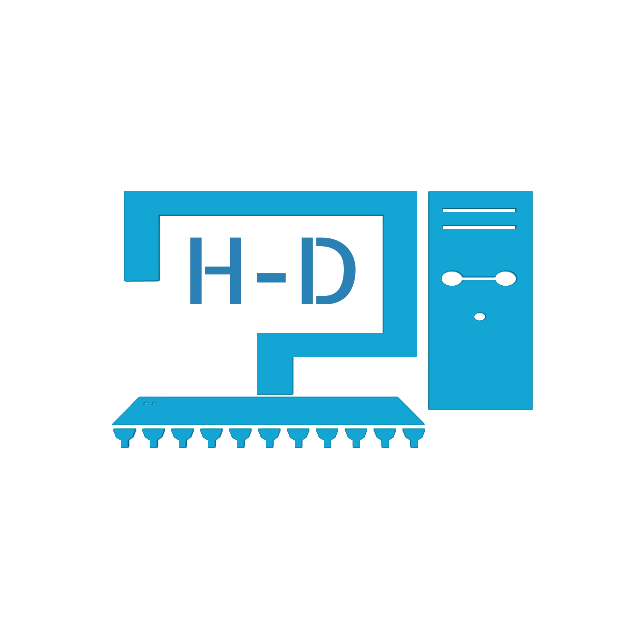
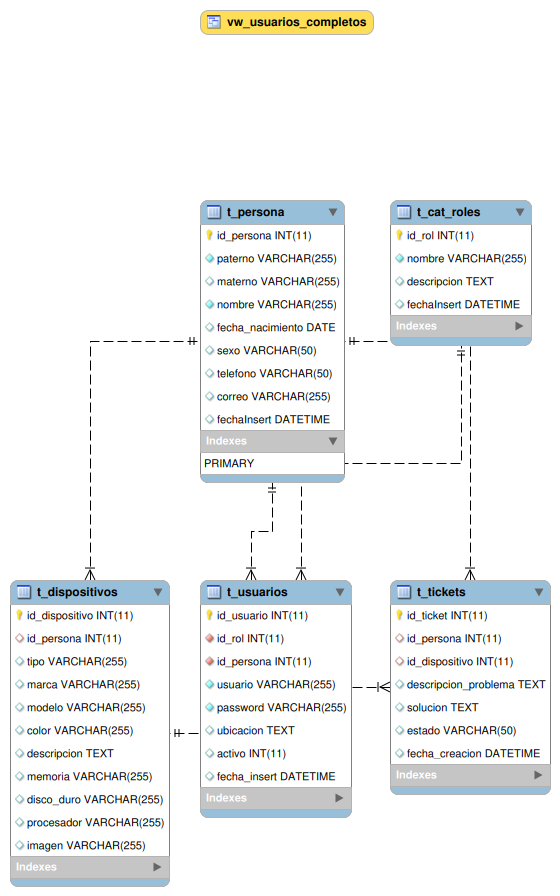

  

<h1 align="center">HelpDesk v1.0</h1>

  
  
  
  

---

## Descripción del Proyecto
El Sistema de Mesa de Ayuda (HelpDesk) es una plataforma integral diseñada para la gestión técnica y operativa de activos digitales y soporte al usuario en entornos corporativos. Su objetivo principal es centralizar y optimizar la atención de solicitudes de asistencia técnica, asegurando la trazabilidad y eficiencia en la resolución de incidencias.

## Justificación
La implementación de este sistema responde a la necesidad de digitalizar procesos que tradicionalmente se gestionan de manera manual o descentralizada, lo cual genera:
*   Inconsistencia en el seguimiento de reportes técnicos.
*   Dificultad en el control de inventario de hardware.
*   Carencia de métricas de rendimiento para el departamento de sistemas.
*   Falta de visibilidad para el usuario final sobre el estado de sus solicitudes.

---

## Reglas de Negocio
Para asegurar la integridad de la información y el flujo correcto de los procesos, el sistema se rige por las siguientes directrices:

### Gestión de Identidad y Acceso
1.  **Perfiles de Usuario:** El sistema reconoce estrictamente dos roles: Administrador (Soporte Técnico) y Cliente (Usuario Final).
2.  **Persistencia de Usuarios:** Un usuario registrado que posea historial de tickets o asignaciones no podrá ser eliminado de la base de datos para preservar la integridad referencial; en su lugar, el registro deberá ser inhabilitado.
3.  **Seguridad de Credenciales:** Todas las contraseñas deben ser procesadas y almacenadas utilizando el algoritmo de encriptación SHA1.

### Administración de Activos e Incidencias
4.  **Asignación de Dispositivos:** Todo hardware debe estar vinculado obligatoriamente a una persona registrada previamente en el catálogo de personal.
5.  **Flujo de Tickets:** Únicamente los usuarios con rol "Cliente" están facultados para la creación de nuevos reportes de soporte.
6.  **Resolución y Cierre:** La autoridad para redactar diagnósticos técnicos, asignar soluciones y realizar el cierre formal de un ticket reside exclusivamente en el rol "Administrador".
7.  **Trazabilidad Temporal:** Cada registro de usuario, asignación o ticket debe incluir una marca de tiempo automática de inserción para fines de auditoría.

---

## Características Técnicas

### Perfil de Administrador
*   Gestión centralizada de usuarios y roles.
*   Inventario y asignación detallada de hardware (especificaciones de CPU, RAM, Almacenamiento).
*   Monitoreo global de tickets, administración de soluciones y control de estados.

### Perfil de Cliente
*   Consulta de dispositivos asignados bajo su responsabilidad.
*   Apertura de tickets de soporte técnico asociados a un activo específico.
*   Consulta de historial de servicios y exportación de reportes en formatos PDF and Excel.

---

## Stack Tecnológico
*   **Backend:** PHP
*   **Frontend:** HTML5, CSS3, Bootstrap 4, jQuery
*   **Gestor de Base de Datos:** MariaDB/MySQL

---

## Mejoras Realizadas (Marzo 2026)

### Seguridad y Estabilidad
*   **Control de Acceso:** Validación de sesiones en todas las interfaces internas para prevenir accesos no autorizados mediante inyección de URL.
*   **Optimización de Arquitectura:** Reestructuración de la lógica de inclusión de archivos y rutas relativas para garantizar la estabilidad de los componentes modales.

### Interfaz de Usuario (UI)
*   **Diseño Crystal:** Implementación de interfaces traslúcidas de alta gama con efectos de desenfoque de capa (**Glassmorphism**).
*   **Adaptabilidad:** Optimización de contenedores visuales para asegurar la correcta superposición de elementos interactivos.

---

## Arquitectura de Datos

---

## Instalación y Setup (Local)
1.  **Requisitos:** PHP 8.x+, MySQL/MariaDB.
2.  **Base de Datos:** Importar el archivo `bd/helpdesk.sql`.
3.  **Configuración:** Ajustar credenciales en `clases/conexion.php`.
4.  **Ejecución:** `php -S localhost:8000`

---

Réplica y personalización por <b>prettyvatt00</b>

